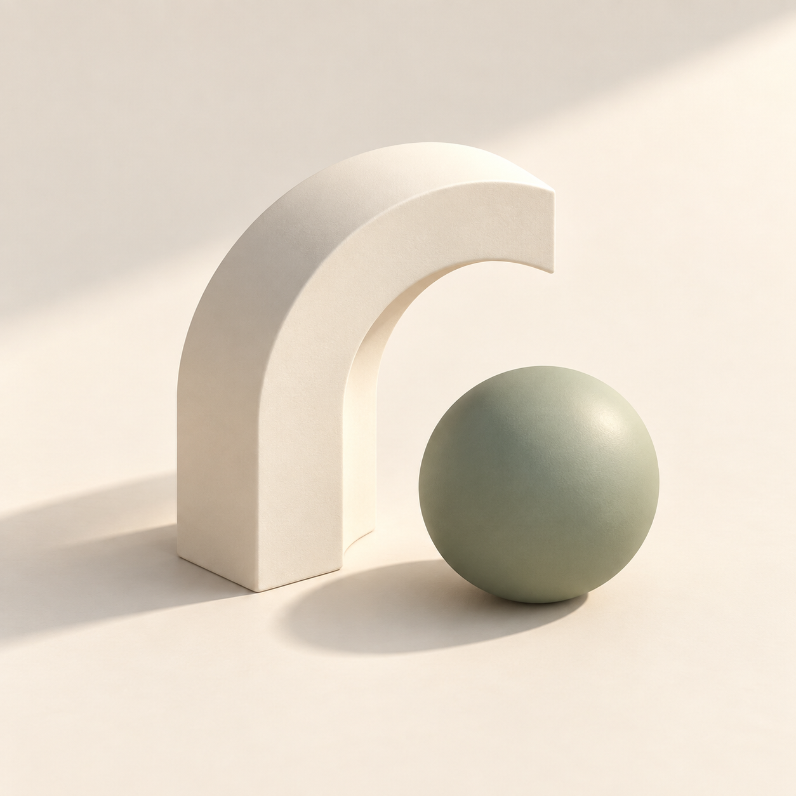
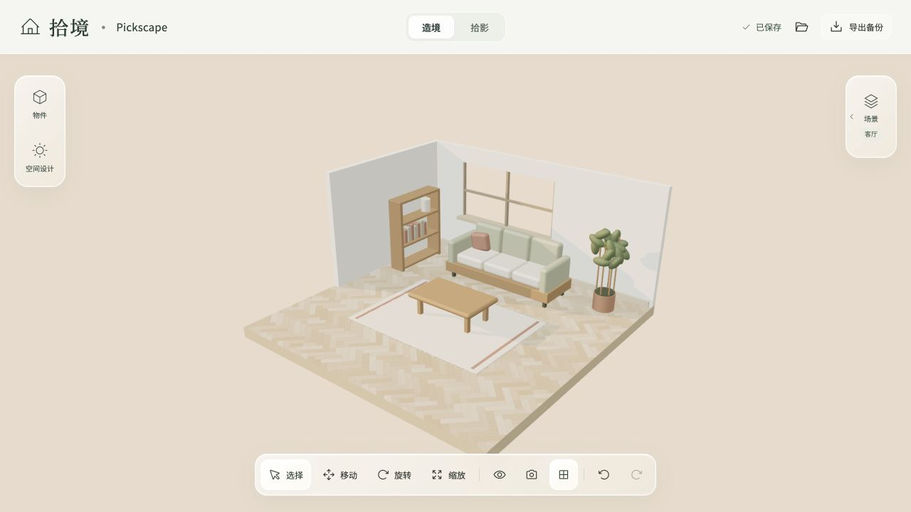
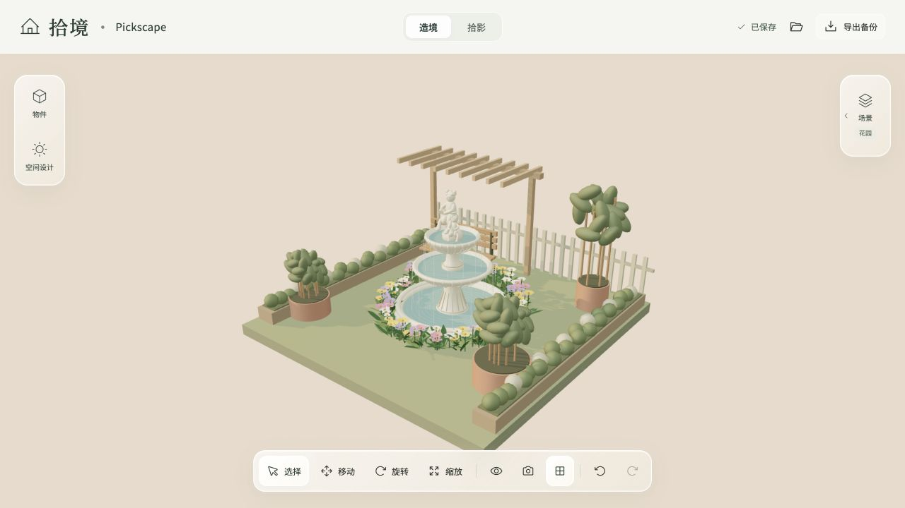
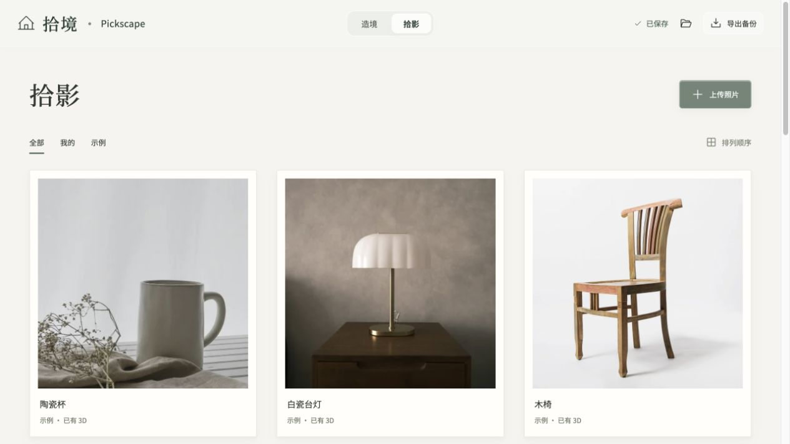

<p align="center">
  
</p>

<h1 align="center">拾境 · Pickscape</h1>

<p align="center">收藏现实灵感，自由构筑自己的 3D 小空间。</p>

拾境是一款在浏览器里运行的轻量空间布置工具。把喜欢的家具、植物、画作摆进客厅、画廊或花园，让那些「不太搭，但我都喜欢」的物件有一个位置。可以慢慢添，也可以摆得满满当当。

## 案例图

以下均为应用实际运行截图，使用内置示例和独立演示项目，不包含个人浏览器收藏。

### 造境 · 客厅

调整家具的位置、朝向与大小，搭配地板、墙面和光影，布置一角自己的生活。



### 造境 · 花园

花架、绿植与环绕繁花的许愿池，也可以成为日常之外的一小块花园。



### 拾影 · 照片收藏

收藏照片与物件参考图，新上传的照片可以在本地制成带立体画框的画作。



## 可以做什么

- **自由布置**：选择、移动、水平旋转、等比缩放、复制、收起与恢复物件，支持撤销和重做。
- **多个空间**：空白、客厅、画廊、花园；分别保存布置，可拓宽空间，也可将收起的物件带去其他场景。
- **物件目录**：家具、灯具、挂画、植物、花架、秋千、水景和小摆件。
- **空间设计**：地板花纹、墙纸、底色以及清晨、正午、傍晚的光影。
- **贴合放置**：普通物件检测承托表面；地毯贴地，挂画支持沿墙调整。
- **拾影收藏**：导入 JPG、PNG、WebP，在照片档案中查看原图和对应模型。
- **本地保存**：项目存储在当前浏览器的 IndexedDB，无需拾境账号。

模型是程序化制作的近似物件，不是实物扫描；承托放置不模拟完整物理碰撞，也不会让桌上的物件随桌子自动搬运。

## 照片装框

**拾影 → 上传照片 → 点击新照片 → 制成装框画作 → 确认使用此模型 → 添加到空间。**

装框按钮目前只对尚无模型的新上传照片显示。照片按原比例装框，图片内容仍然是平面的；当前没有裁切、自动抠图或从照片重建真实三维家具的功能。

## 本地启动

需要 **Node.js 22+** 和 npm。

```sh
git clone https://github.com/hanjingwang-comm/Pickscape.git
cd Pickscape
npm ci
npm run dev
```

打开终端显示的 `http://127.0.0.1:5173/`。

```sh
npm test          # 核心交互、资产、模拟生成接口与渲染预算测试
npm run build    # 普通浏览器版，输出 dist/
npm run preview  # 本地预览构建结果
```

本项目以现代桌面浏览器为主要编辑环境，精确拖拽推荐鼠标。测试中的生成服务使用本地模拟，不需要 API 密钥或云端额度。

### 数据与备份

数据按浏览器、域名和端口隔离。换浏览器、换端口或部署到新地址不会自动带走旧项目；清理站点存储会丢失本地数据。

普通浏览器版可在「项目与备份」导出和导入 `.pickscape`，兼容旧版 `.yidu`。导入创建独立项目，不覆盖已有项目。上传照片每张不超过 20 MB；手动导入的 GLB 不超过 50 MB，必须自包含，且不支持 Draco / Meshopt / KTX 压缩资源。

快捷键：`⌘ / Ctrl + Z` 撤销，`Shift + ⌘ / Ctrl + Z` 重做，`⌘ / Ctrl + D` 复制，`Delete` 删除；输入框中不会触发编辑器快捷键。

## 小红书离线小工具版

提供独立离线 H5 构建，适配用户提供的 [minitool-zip-builder 1.6.0](https://fe-static.xhscdn.com/mini-tool/20260831163932/minitool-zip-builder-1.6.0.skill)。构建还需要 Python 3 与 Pillow：

```sh
python3 -m venv .venv
.venv/bin/python -m pip install Pillow
PICKSCAPE_PYTHON="$PWD/.venv/bin/python" npm run build:minitool
```

Windows 可将 `PICKSCAPE_PYTHON` 设为虚拟环境中 Python 的完整路径。已有带 Pillow 的 Python 时，直接指定该解释器即可；未设置时默认使用 `python3`。

输出 `dist-minitool/` 与 `pickscape-minitool-0.1.0.zip`。ZIP 和本机构建目录不提交到源码仓库，用户自己的浏览器数据也不会被打入包中。

| 能力 | 普通浏览器版 | 离线小工具版 |
|---|---|---|
| 内置物件与空间编辑 | 支持 | 支持，超出渲染预算时进入轻量布局 |
| 本地选图与照片装框 | 支持 | 支持，真机选图兼容性待验收 |
| GLB 模型导入 | 支持 | 不提供 |
| 项目备份导入 / 下载 | 支持 | 不提供 |
| 联网图片转 3D | 接口预留，默认关闭 | 禁用 |
| 本地保存 | IndexedDB | IndexedDB，受容器存储生命周期影响 |

小工具版资源随包携带，使用经典脚本并提供局部兼容回退；缺少 WebGL2、图形上下文中断或负载超预算时切换轻量布局。已有严格 CSP 本地浏览器验证，尚未完成小红书模拟器、Android / iOS 真机及真实 Chrome 61 验收。

## 预留的图片转 3D 接口

当前版本 **不启用自动图片转 3D，也无需配置密钥**。`MESHY_ENABLED` 默认为 `false`；接口代码保留供后续开发。服务端适配仅用于本机开发与预览，静态部署 `dist/` 不包含该后端。

后续如明确启用，使用 `.env.example` 作为本地配置模板。密钥只能保存在被忽略的 `.env.local`，不要使用 `VITE_` 前缀或放进前端代码。真实生成涉及向第三方发送图片和消耗额度；本仓库的离线小工具构建不包含这条调用链。

## 项目结构

```text
src/
  App.tsx                 页面、侧栏、照片档案与项目操作
  Scene.tsx               3D 场景和交互
  store.ts                状态、撤销重做与实例操作
  storage.ts              本地存储、导入导出与校验
  painting.ts             照片装框
  gardenProps.ts           程序化物件目录
  assets/references/      构建所需的 24 张参考图
  minitool/               离线容器适配与渲染降级
server/                   默认关闭的生成接口及模拟测试
scripts/build-minitool.mjs 离线 ZIP 构建
public/                   示例照片、本地字体及授权文件
docs/images/              产品图标和案例截图
```

技术栈：React · TypeScript · Vite · Three.js / React Three Fiber · Zustand · IndexedDB。

## 素材说明

- 陶瓷杯：Debby Hudson，[Unsplash 原图](https://unsplash.com/photos/NiQjjEnfS-c)，Unsplash License。
- 白瓷台灯：Evan Marvell，[Unsplash 原图](https://unsplash.com/photos/L3dZoRESfmM)，Unsplash License。
- 木椅：Ksenia Chernaya，[Pexels 原图](https://www.pexels.com/photo/11112728/)，Pexels License。
- 字体为本地思源黑体与思源宋体用字子集，授权文件位于 `public/fonts/`。
- 产品头像由 AI 生成；案例截图来自应用实机浏览器画面。
- 物件参考图片保留用于展示原型与建模来源，不代表项目拥有其版权；第三方图片和字体遵循各自权利与许可。仓库公开不构成对第三方素材的再授权。
